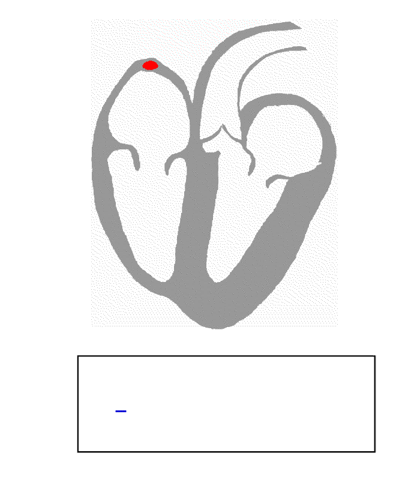

# ECG-Anomaly-Detection
Machines Learning for Monitoring Abnormal Heart Beats on Electrocardiogram (ECG) Recordings

# Problem Statement
Monitoring hearth health is an important medical problem: abnormalities in heart activity can be warning signs of serious adverse medical events such as heart attack and stroke. Heart activity is monitored in clinical settings with the electrocardiogram (ECG), as device which records and digitizes electrical signals from the heart. Internet-of-things (IoT) devices, such as smartwatches, can now record ECG signals. These can be transmitted to a computer in order to detect and classify abnormal heartbeats in order to warn users as well as their heath care providers. State-of-the-art medical ECG systems acquire high-temporal-resolution signals from several channels at once, and process these signals on dedicated hardware. ECG recordings from smartwatches currently provide data from a single channel, as lower temporal resolution, and possibly with lower signal quality. ECG data from a smarthwatch might be processed on a  device with low power computational power, such as a smartphone, or a user's laptop. Thus, applying standard machine learning approaches to detect and classify abnormal heartbeats from low resolution ECG data is a worthwhile goal for improving new IoT-based ECG recording system.  For this purpose, the present project implements and assesses Python-based machine learning solutions to learn to classify ECG heart beat recordings.

# Methods

# Data sources:
## MIT-BIH Arrhythmia Database (Requires creating an account to access the data)
https://physionet.org/content/mitdb/1.0.0/
https://console.cloud.google.com/storage/browser/mitdb-1.0.0.physionet.org
Clinical ECG recordings (30 min, dual-lead, 125 Hz) from 48 adults, 23 with rare heart conditions
109,000 manually segmented, expert-labeled heart beat samples
Standard ECG data format (.dat) with expert annotations (.atr, text labels)

WFDB Python libary (https://github.com/MIT-LCP/wfdb-python) is required to read ECG data 

Alternatively,
## Same data, in csv format, are available from Kaggle:    
(requires Kaggle account for access)

## Pre-processed ECG data, in the form of numpy arrays, are available in this repository:
- inset link -

# Replicating the data analyses

## To clone this repository
git clone https://github.com/andturken/ECG-Anomaly-Detection.git
cd ECG-Anomaly-Detection

Depends on: Python 3.7, scipy, pandas, numpy, matplotlib, sklearn (0.23.1), imbalanced-learn

## Run Script to create data matrices:

## Pre-process ECG data
python ---.py
This will: 1-) Read MIT-BIH ECG data in CSV format into memory 2-) Extract ECG segments corresponding to individual heart beats

The result is saved in ---

## Modeling: 
python 

This script will

## Modeling: Combined unsupervised learning and classification
python

This script will:

# Exploratory Data Analysis 

## Key observations from EDA

# Modeling Results

##

##

# Conclusion

# Future Work

Use single-channel continuous electrocardiogram (ECG) time-series recordings to train a deep learning network in order to:
1) Detect individual heartbeats; quantify onset, peak latency, duration
2) Detect irregular heartbeats; classify anomaly type
3) Flag time windows during which hearbeats are arhythmic (irregular R-R intervals)
4) Identify patients whose heartbeats patterns are anomalous (e.g., diagnose arhythmia)
5) Apply ECG anomaly detection algorithm trained on one clinical dataset to ECG datasets from other sources (e.g., transfer learning)

